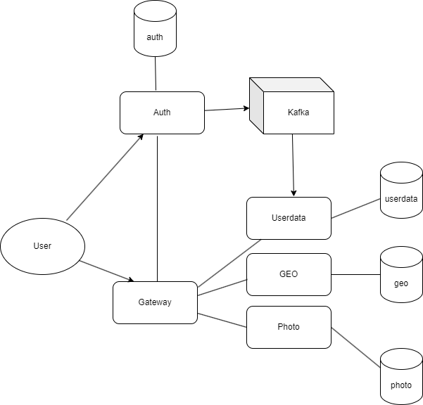

# Rangiffler

## Как запустить
#### Если у вас Windows - используйте bash терминал
### Подготовка:
###### Используемые порты должны быть свободны: 
3001, 80, 9000, 8080, 8091, 8092, 8093
#### 1. Установить docker (Если не установлен)
[Установка на Windows](https://docs.docker.com/desktop/install/windows-install/)

[Установка на Mac](https://docs.docker.com/desktop/install/mac-install/)

[Установка на Linux](https://docs.docker.com/desktop/install/linux-install/)

- Запустите docker
- Убедитесь, что работают команды docker, например набрав в терминале `docker -v`

```posh
Docker version 26.0.0, build 2ae903e
```
#### 2. Установить пакетный менеджер для сборки front-end npm
[Инструкция](https://docs.npmjs.com/downloading-and-installing-node-js-and-npm).
Рекомендованная версия Node.js - 18.13.0 (LTS)

#### 3. Убедитесь, что у вас установлена java версии 17 или новее
`java -version`

```posh
openjdk version "19" 2022-09-20
OpenJDK Runtime Environment (build 19+36-2238)
OpenJDK 64-Bit Server VM (build 19+36-2238, mixed mode, sharing)
```

#### 4. Создать volume для БД и отчетов allure
`docker volume create rangiffler-all-db`

`docker volume create rangiffler-allure-artifacts`

### Локальный запуск в IDE

#### 1. Запустить БД, zookeeper, kafka и frontend
Выполните скрипт `bash localenv.sh`

#### 2. Запустить backend
- Прописать run конфигурацию для всех сервисов rangiffler-* - Active profiles local

Для этого зайти в меню Run -> Edit Configurations -> выбрать main класс -> указать Active profiles: local
[Инструкция](https://stackoverflow.com/questions/39738901/how-do-i-activate-a-spring-boot-profile-when-running-from-intellij).

- Запустить сервис auth

```posh
cd rangiffler-auth
gradle bootRun --args='--spring.profiles.active=local'
```

Или просто перейдя к main-классу приложения RangifflerAuthApplication выбрать run в IDEA (предварительно удостовериться что
выполнен предыдущий пункт с указанием профиля local)

- Запустить в любой последовательности другие сервисы: rangiffler-gateway, rangiffler-geo, rangiffler-photo, rangiffler-userdata

#### 3. Открыть сайт в браузере
`http://127.0.0.1:3001`

### Запуск в docker
#### 1. Прописать в etc/hosts элиас для Docker-имени
```posh
127.0.0.1       allure
127.0.0.1       frontend.rangiffler.dc
127.0.0.1       auth.rangiffler.dc
127.0.0.1       gateway.rangiffler.dc
```
#### 2. Сбилдить и запустить все сервисы
Выполните скрипт `bash docker-compose.sh`

#### 3. Открыть сайт в браузере
`http://frontend.rangiffler.dc`

### Запуск тестов
#### 1. Прописать в etc/hosts элиас для Docker-имени
```posh
127.0.0.1       allure
127.0.0.1       frontend.rangiffler.dc
127.0.0.1       auth.rangiffler.dc
127.0.0.1       gateway.rangiffler.dc
```
#### 2. Сбилдить и запустить все сервисы и тесты
Выполните скрипт `bash docker-compose-test.sh`

#### 3. Открыть сайт с отчетами в браузере
`http://allure:5252/allure-docker-service-ui/projects/default`

Важно! Тесты проходят не сразу и если вы видите количество тестов 0 - подождите и обновите страницу

Чтобы просмотреть логи тестов и убедиться, что они окончены выполните команду 

`docker logs -f rangiffler-tests`